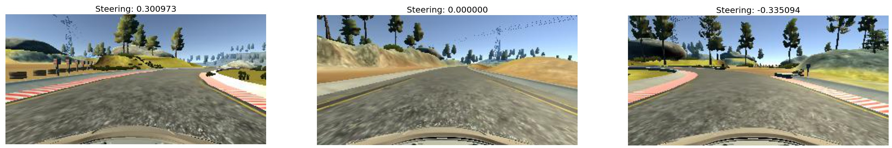
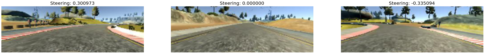
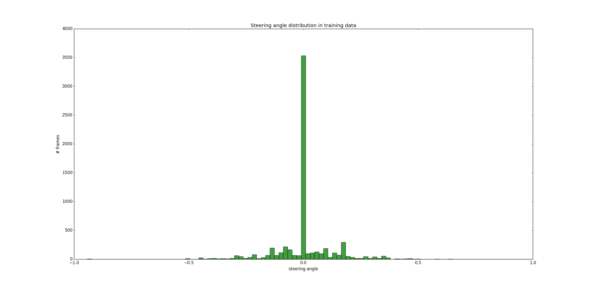
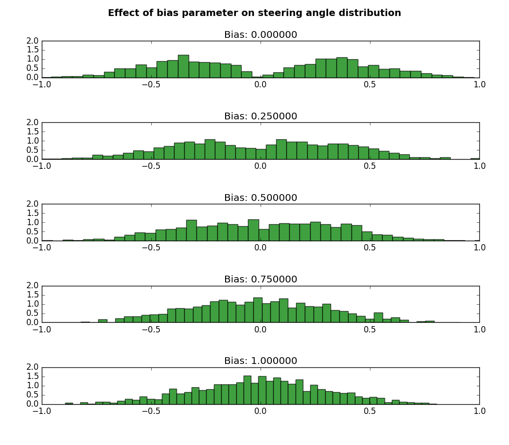
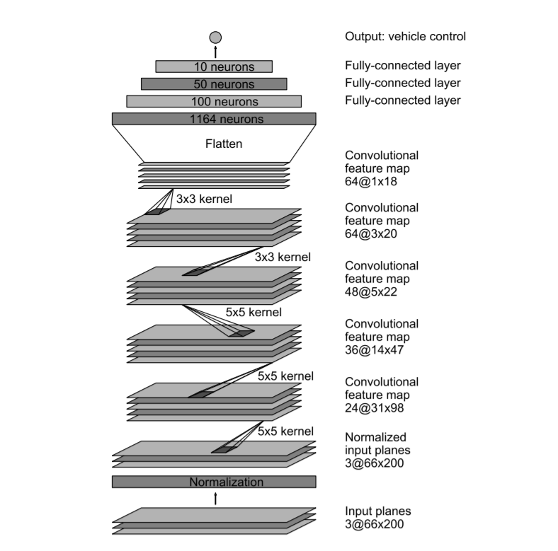

# 🚗 Self Driving Car using CNN  
### ⚡ Behavioral Cloning Project

---

## 📌 🔥 Project Overview
This project demonstrates a **Self-Driving Car System** using **Deep Learning (CNN)**.  
The model learns from human driving behavior and predicts **steering angles in real-time**.

👉 Final goal: **Autonomous driving in simulator**

---

## 🎯 💡 Objective
✔ Learn human driving behavior  
✔ Predict steering angle from images  
✔ Drive car automatically in simulator  

---

## 🧠 ⚙️ Concept Used
👉 **Behavioral Cloning**
- Human drives car → data collected  
- Model learns patterns  
- Model imitates driving behavior  

---

## 📂 🗂 Project Structure
├── drive.py 🔹 Run model in simulator

├── model.py 🔹 CNN architecture

├── load_data.py 🔹 Data loading & augmentation

├── config.py 🔹 Parameters

├── visualize_data.py 🔹 Data visualization

├── visualize_activations.py 🔹 Model insights

├── pretrained/ 🔹 Saved model

├── img/ 🔹 Images

└── README.md

## 🎮 🚀 Simulator Setup

👉 Download simulator:  
https://github.com/udacity/self-driving-car-sim/releases  

### Steps:
1. Download for your OS  
2. Extract zip  
3. Run simulator  
4. Choose:
   - 🟢 Training Mode  
   - 🔵 Autonomous Mode  

---

## 📊 📁 Dataset

👉 Download dataset:  
https://github.com/rslim087a/track  

✔ Center / Left / Right images  
✔ Steering angle  

⚠️ Dataset not included (large size)

---

## 🖼 📷 Sample Data

### Before Preprocessing

### After Preprocessing

---

## 📉 📊 Data Distribution

⚠️ Problem: Data biased toward straight driving  

---

## ⚙️ 🔄 Data Augmentation

✔ Left & right camera usage  
✔ Brightness adjustment  
✔ Image flip  
✔ Steering noise  
✔ Bias filtering  

---

## 🧱 🧠 Model Architecture

👉 Based on NVIDIA End-to-End Model  

---

## 🧪 ⚡ Training Details

✔ Optimizer: Adam  
✔ Loss: MSE  
✔ GPU used  
✔ Augmentation applied  

---

## 🚀 ▶️ How to Run

### Step 1: Install Libraries
pip install numpy pandas tensorflow keras opencv-python matplotlib scikit-learn flask socketio

### Step 2: Run Model
python drive.py

### Step 3: Start Simulator
👉 Select **Autonomous Mode**

---

## 🎥 🎬 Demo

👉 https://www.youtube.com/watch?v=gXkMELjZmCc  

---

## ⚠️ 🚧 Challenges

- Data imbalance  
- Overfitting  
- Limited dataset  
- Generalization  

---

## 🔮 🚀 Future Work

✔ Add throttle prediction  
✔ Improve real-world performance  
✔ Train on diverse tracks  

---

## 👨‍💻 🙋 Author

**Vivek Vishwakarma**

---

⭐ If you like this project, consider giving it a star!
